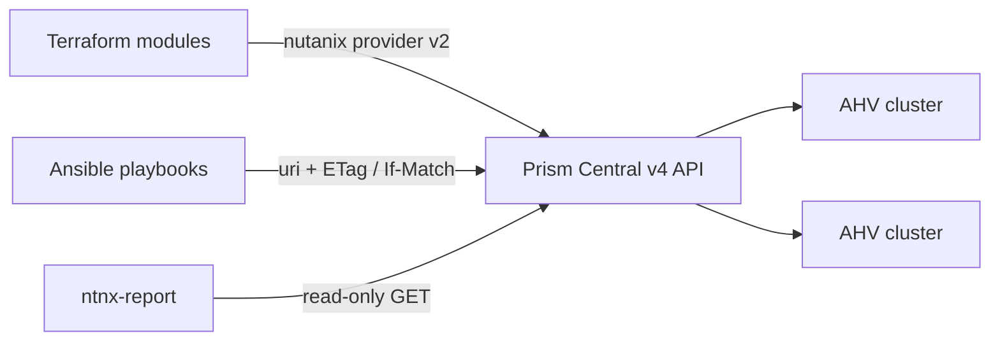

# Nutanix Infrastructure-as-Code Toolkit

Day-0 to day-2 automation for Nutanix AHV clusters managed by Prism Central, built on the GA **v4 APIs**.

| Part | What it does | Tooling |
|---|---|---|
| [`terraform/`](terraform) | Provision AHV VLAN subnets (with optional IPAM), categories, a cloud image and VMs with cloud-init | Terraform, `nutanix/nutanix` provider 2.4 (`*_v2` resources) |
| [`ansible/`](ansible) | Day-2 operations: VM power actions, category tagging, VM inventory export | Ansible (`ansible.builtin` only) calling the Prism Central v4 REST API |
| [`reporter/`](reporter) | Per-cluster capacity and health report (vCPU:pCore ratio, memory allocation, unresolved alerts) | Python, Prism Central v4 REST API |



## Status

- Terraform modules are checked with `terraform validate` against the schema of provider v2.4.2, and their logic is
  covered by `terraform test` with a mocked provider (7 runs).
- Ansible playbooks are tested against an in-memory Prism Central v4 stand-in that enforces basic auth, `If-Match`
  ETags and `NTNX-Request-Id` headers (6 tests).
- The reporter is unit-tested against v4-shaped payloads (12 tests).
- API paths and field names were taken from the official Nutanix v4 SDKs (`ntnx-*-py-client`) and the provider source.
- **Next step:** run everything end to end against a Nutanix Community Edition cluster and record the results in
  [`docs/LAB_VALIDATION.md`](docs/LAB_VALIDATION.md).

## Quick start

Credentials always come from the environment, never from files in the repository:

```bash
export NUTANIX_ENDPOINT=pc.lab.local    # Prism Central FQDN or IP
export NUTANIX_USERNAME=automation-svc
export NUTANIX_PASSWORD='...'
```

### Terraform: subnets, categories, image and VMs

```bash
cd terraform/environments/lab
cp terraform.tfvars.example terraform.tfvars   # edit cluster, VLANs, VMs
terraform init
terraform plan -out lab.plan
terraform apply lab.plan
```

Modules:

- `modules/ahv-subnet`: a VLAN subnet on a cluster; set `ipam` for AHV-managed DHCP (network, gateway, pool, DNS)
- `modules/categories`: `{ Key = [values] }` in, one `nutanix_category_v2` per pair out
- `modules/ahv-vm`: boot disk cloned from an image, optional data disks, one NIC per subnet, categories,
  legacy or UEFI boot, cloud-init user-data

The lab environment creates `DR-Tier:*` categories, so protection policies in Prism Central can select VMs by
category. These match the policy names generated by
[Nutanix Migration Factory](https://github.com/abdullahGhani1/nutanix-migration-factory).

### Ansible: day-2 operations

```bash
cd ansible
ansible-playbook playbooks/vm_power.yml -e '{"vm_names": ["lab-web-01"], "power_action": "guest-shutdown"}'
ansible-playbook playbooks/vm_categories.yml -e '{"vm_names": ["lab-db-01"], "categories": ["DR-Tier:PP-NEARSYNC-15M"]}'
ansible-playbook playbooks/vm_inventory_report.yml -e report_path=./vm_inventory.csv
```

Every mutation follows the v4 contract: read the VM, send its `ETag` as `If-Match`, send a unique `NTNX-Request-Id`,
then poll the returned task until it finishes. Power actions are idempotent; a VM already in the target state is
skipped. Unknown VMs or categories fail before anything is changed.

These playbooks use only `ansible.builtin`, so they run on any Ansible install with no collection to vendor. The
official [`nutanix.ncp`](https://galaxy.ansible.com/ui/repo/published/nutanix/ncp/) collection is the alternative
when you'd rather use the vendor modules.

### Reporter: capacity and health

```bash
cd reporter
pip install -e .
ntnx-report --pc https://$NUTANIX_ENDPOINT:9440 --username $NUTANIX_USERNAME --format md --out report.md
ntnx-report --fixtures examples/lab            # offline demo with sample data
```

Exit code `2` means at least one cluster is CRITICAL, so a scheduled job fails visibly. Thresholds are flags
(`--vcpu-ratio-warning 3 --vcpu-ratio-critical 4 --memory-warning 80 --memory-critical 90`). Figures are
allocation-based for powered-on VMs, not measured utilization. The Prism Central cluster entity is excluded.

Sample output (from `examples/lab`):

| Cluster | Status | Hosts | Cores | vCPU | vCPU:pCore | RAM GiB | RAM alloc | Crit / Warn alerts |
|---|---|---:|---:|---:|---:|---:|---:|---:|
| DC2-AHV-DR | CRITICAL | 3 | 48 | 192 | 4.0 | 768.0 | 91.7% | 1 / 0 |
| DC1-AHV-PROD | WARNING | 3 | 96 | 28 | 0.29 | 1536.0 | 10.9% | 0 / 1 |

## Security

- Least privilege: the reporter needs only read access. The playbooks need VM power and category-assignment
  permissions. Terraform needs create rights for what it manages. Use separate Prism Central service accounts.
- `insecure = true` / `--insecure` exist for Community Edition self-signed certificates. In production, trust the
  Prism Central CA instead (`--ca-bundle`).
- `*.tfvars` and Terraform state are git-ignored. Use a remote backend with encryption for shared state.

## Testing

```bash
make test   # terraform fmt/validate/test, ansible syntax/lint/tests, ruff and pytest
```

CI runs the same checks on every push (`.github/workflows/ci.yml`).

## Roadmap

- [ ] Validate end to end on Nutanix Community Edition (`docs/LAB_VALIDATION.md`)
- [ ] Terraform module for protection policies and recovery plans (`dataprotection` / `datapolicies` v4)
- [ ] Ansible playbook for on-demand VM recovery points before change windows
- [ ] Reporter: storage-container usage and measured utilization from v4 stats endpoints

## License

MIT
